# eChapter - Online Bookstore

Visit the live site: [eChapter](https://echapter-pp5-a9a674e8d251.herokuapp.com/)

## Table of Contents

1. [Introduction](#introduction)
   - [Buiness Goals](#business-goals)
   - [Customer Goals](#customer-goals)
2. [Acceptance Criteria](#acceptance-criteria)
3. [Design and UX](#design-and-ux)
   - [Wireframes](#wireframes) 
   - [Database Model](#database-model) 
4. [Epic and User Stories](#epic-and-user-stories)
   - [Epic](#epic)
   - [User Stories](#user-stories)
5. [Features](#features)
   - [Site Navigation](#site-navigation)
   - [Footer](#footer)
   - [Home Page](#home-page)
   - [Products Page](#products-page)
   - [Book Details Page](#book-details-page)
   - [Shopping Bag Page](#shopping-bag-page)
   - [Checkout Page](#checkout-page)
   - [Profile Page](#profile-page)
   - [Product Management Page](#product-management-page)
   - [Confirmation Of Purchase Email](#confirmation-of-purchase-email)
   - [Toast Notifications](#toast-notifications)
   - [Custom Error Pages](#custom-error-pages)
   - [Contact Us Form](#contact-us-form)
6. [Future Features](#future-features)
7. [SEO & Marketing](#seo--marketing)
8. [Testing](#testing)
9. [Project Management and Documentation](#project-management-and-documentation)
10. [Deployment](#deployment)
      - [Deploying to Heroku](#deploying-to-heroku)
      - [AWS](#aws)
      - [Cloning and Forking](#cloning-and-forking-the-github-repository)
11. [Technologies Used](#technologies-used)
      - [Programming Languages](#programming-languages)
      - [Frameworks & Libraries](#frameworks--libraries)
      - [APIs](#apis)
      - [Databases](#databases)
      - [Version Control](#version-control)
      - [Hosting/ Servers](#hostingservers)
      - [Storage](#storage)
      - [Planning & Documentation](#planning-and-documentation-tools)
      - [Other Tools](#other-tools)
12. [MoSCow Prioritization](#moscow-prioritization)
13. [Credits](#credits)
14. [Acknowledgements](#acknowledgements)

# Introduction

The digital age has made it easier than ever to access a wide range of books across multiple genres. However, with the vast array of options available, it can be overwhelming for readers to find books that cater to their specific interests, let alone in a user-friendly manner. eChapter was created as a solution to this problem, offering a carefully curated collection of books for a diverse readership, all available at the click of a button.

The primary purpose of eChapter is to provide an online platform where users can explore, select, and purchase books with ease. Our aim is to simplify the book-buying process while offering a wide range of options to cater to varied reading interests. eChapter targets a wide range of audiences, including but not limited to: avid readers, casual readers, students and profesionals.

Addressing User Needs, eChapter aims to meet the varying needs of its target audience. 

- Ease of Use: A clean, intuitive interface ensures that users can navigate the site easily.
- Search and Filters: Robust search functionality, along with various filter options, help users find books that fit their interests or needs.
- Secure Transactions: Integration with Stripe ensures a secure and smooth checkout process.
- Accessibility: The responsive design ensures that users can access the site from any device
- Personalized Experience: User profiles and book recommendations cater to individual reading preferences, enhancing the shopping experience.

### Business Goals

- Market Penetration: To become a notable player in the online bookstore industry within the first year of operation.
- Customer Retention: Achieve a customer retention rate of at least 70% within the first two years.
- Revenue Growth: Aim for a 20% increase in revenue quarter-over-quarter for the first two years.
- Expand Inventory: Increase the catalog by 50% in the first year, focusing on niche markets and special interests.
- Brand Recognition: Establish eChapter as a trusted brand synonymous with diverse reads and customer service excellence.

### Customer Goals

- Accessibility: Find and purchase books with ease from any device.
- Affordability: Competitive pricing and special offers to make reading more affordable.
- Diversity: Access to a broad range of titles across various genres and themes.
- Personalization: Tailored recommendations and a user-friendly interface for a unique shopping experience.
- Support: Efficient customer support to assist with inquiries and issues.

[Back to the top](#)

## Acceptance Criteria

### User Authentication

#### Login

- Users must enter both a username and a password.
- Users should receive an error message for incorrect login credentials.
- Successful login directs the user to their dashboard.

#### Sign Up

- Users must enter a valid email address.
- Password must be at least 8 characters long.
- A confirmation email is sent upon successful registration.

### User Profile

- Users can view their profile containing past orders.
- Users can update their profile information.

### Product Management (For Admins)

#### Add New Book

- Admins can add a new book to the store.
- All book details such as title, author, price, and ISBN must be provided.
- Book cover image should be uploadable.

#### Edit Existing Book

- Admins can edit the details of an existing book.
- Changes should reflect immediately.

### Book Browsing and Search

- Users can browse books by categories and price.
- A search function should return relevant results based on book title or author.

### Shopping Bag

#### Add to Bag

- Users can add books to their shopping bag.
- The bag should update in real-time.

#### Update Bag

- Users can modify the quantity of books in the shopping bag.
- The subtotal should update dynamically.

#### Remove from Bag

- Users can remove items from the bag.
- The item should be immediately removed, and the total price should update.

### Checkout

- Users can proceed to checkout from the bag.
- All required fields like shipping address and payment details must be filled out.
- Users should be able to use Stripe for payments.

### Payments

- Stripe should process payments successfully.
- Users should receive a confirmation email upon successful payment.
- The admin should be able to see the payment in the Stripe dashboard.

### Miscellaneous

- The site should be responsive, especially on small screens (mobiles and tablets).
- Users should receive notifications for major actions like login, book added to bag, and successful payment.

[Back to the top](#)

# Design and UX

### Background Colors

The background colors for eChapter have been carefully selected to provide a neutral yet inviting canvas that allows the products and text to be the focal points. The primary background color is a light shade, which not only provides excellent contrast for text but also creates an open and airy feel, mimicking the experience of walking into a well-lit, organized bookstore.

### Text Colors

Text colors are primarily dark shades like black or dark gray. The aim is to maximize readability and reduce eye strain, especially during prolonged use. We've also employed color hierarchy; headlines or important text elements might be in bold and a darker shade, while secondary text could be a lighter shade of gray.

The color scheme is a crucial part of the overall design and user experience of eChapter. It serves functional purposes, like readability and accessibility, while also contributing to the brand's emotional resonance with users. Careful selection and testing have gone into these choices to create an interface that is not just visually pleasing but also user-friendly.

### Wireframes

- Home Page

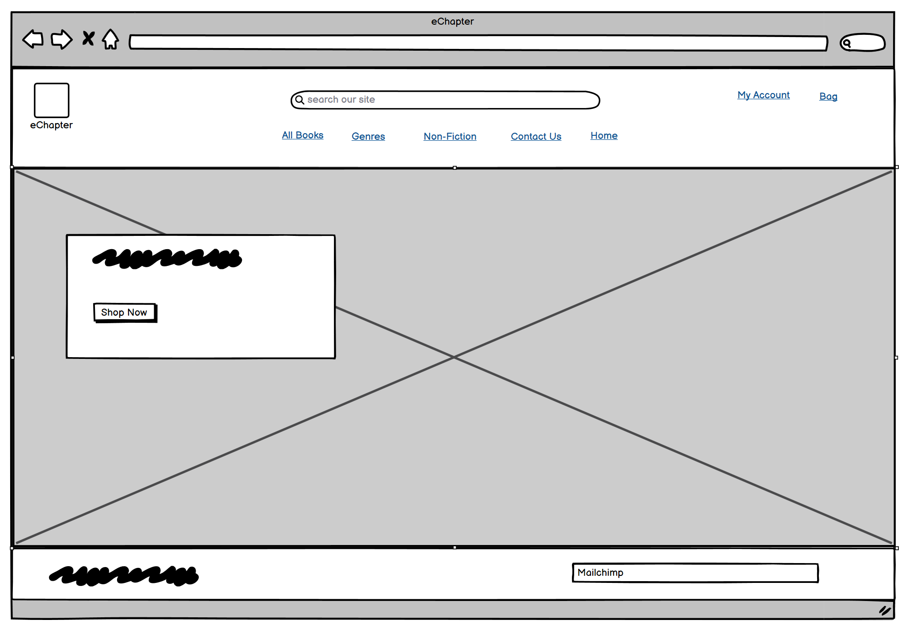

- Products Page

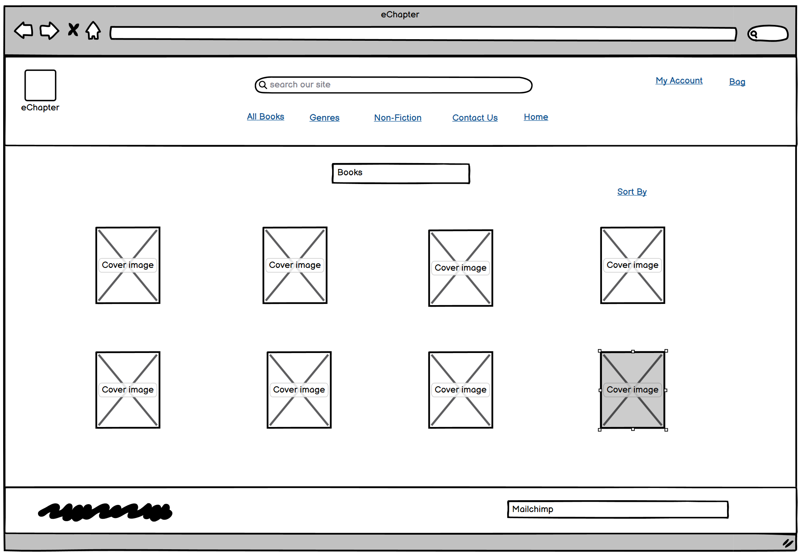

- Product Detail Page

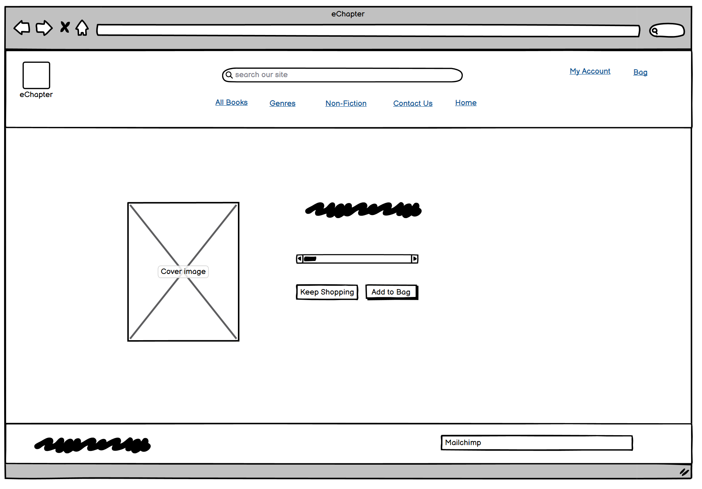

- Shopping Bag Page

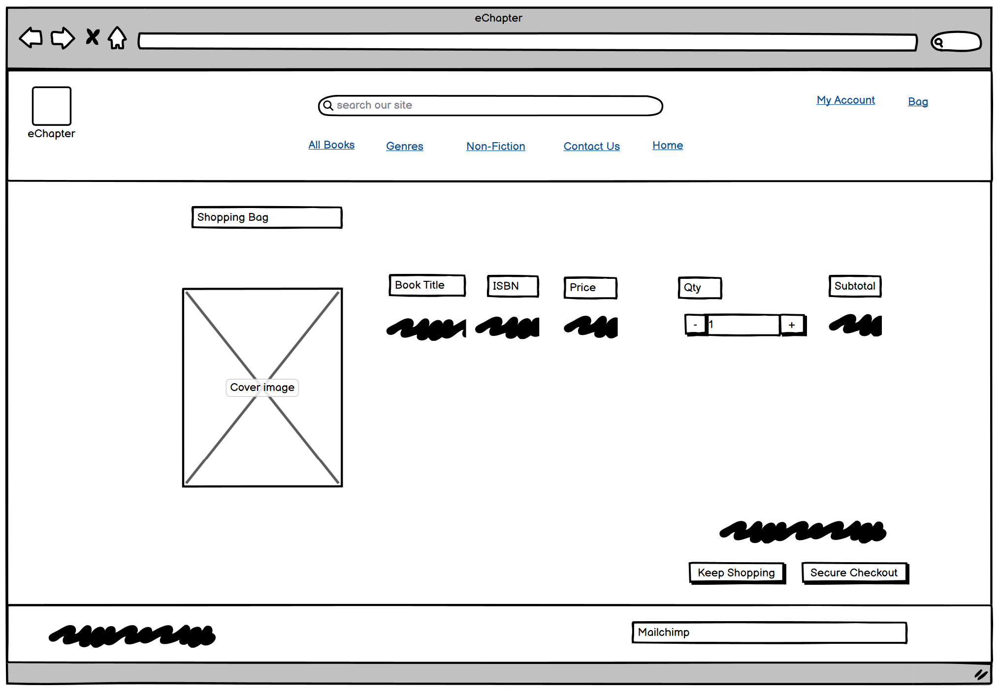

- Checkout Page

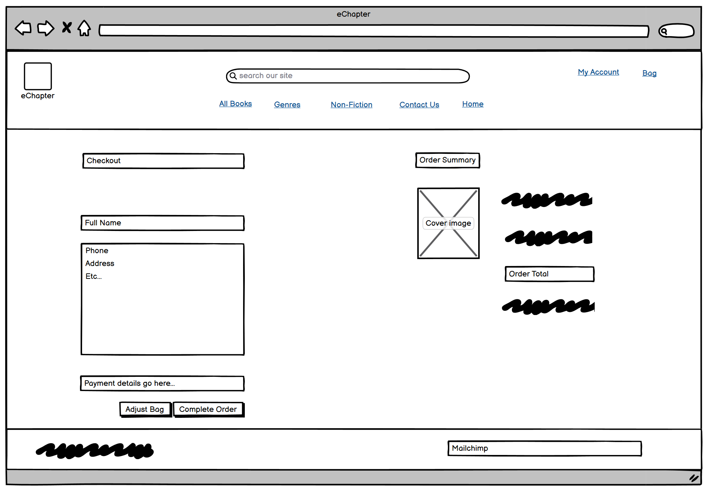

- Profile Page

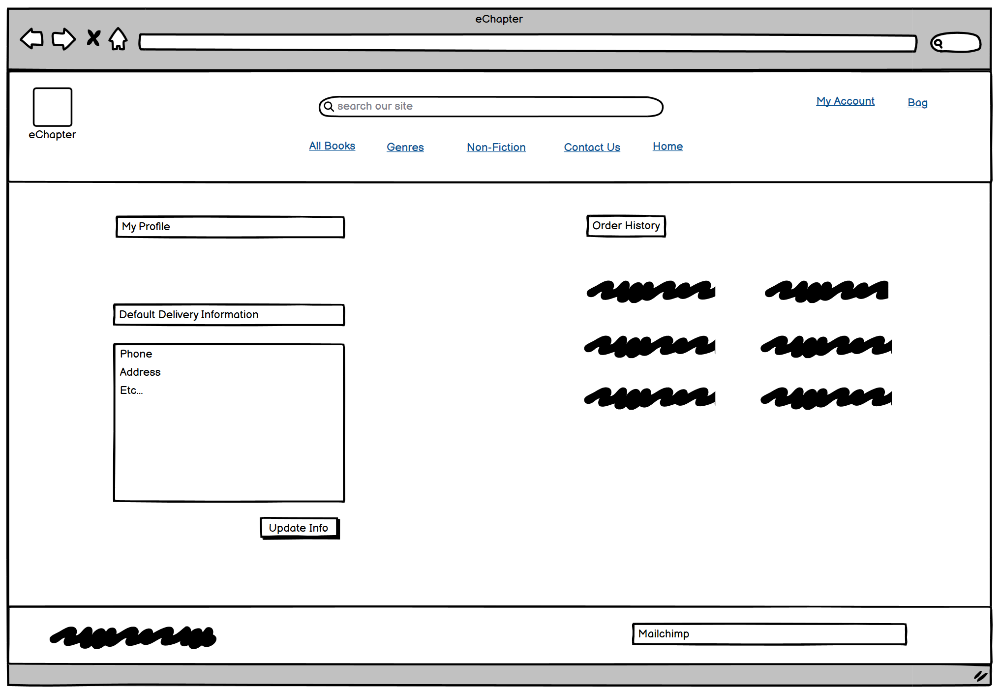

### Database Model

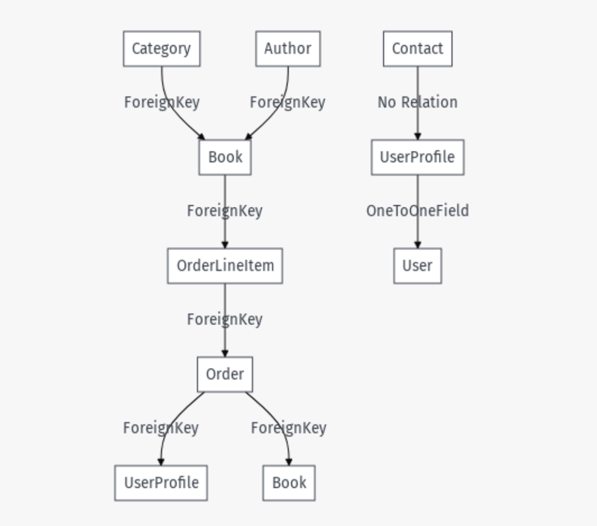

- Category and Author models in the products app are connected to the Book model via ForeignKey fields.
- The Book model is connected to OrderLineItem in the checkout app, which in turn is connected to Order.
- Order is connected to UserProfile in the profiles app.
- UserProfile has a OneToOneField relationship with Django's built-in User model.
- The Contact model in the contactus app is not directly related to any other models.

# Epic and User Stories

### Epic

The overarching epic of the eChapter project is to revolutionize the way people discover, purchase, and engage with books in a digital landscape. In an era where physical bookstores are dwindling and the power of choice is at our fingertips, eChapter aspires to be the trusted online portal for literature enthusiasts, students, and professionals alike. Through features like a diverse catalog, personalized recommendations, and seamless payment options, the project aims to offer more than just a transactional experience; it seeks to build a community of avid readers. By merging the cozy ambiance of a traditional bookstore with the convenience and efficiency of online shopping, eChapter sets out to preserve the essence of reading while adapting to the demands of the modern world. Every design decision, feature implementation, and user interaction is guided by this epic, ensuring that the platform is not just a marketplace but a sanctuary for those who find solace in the written word.

### User Stories

### Viewing and Navigation

| User Story Number | As A/An | I can                     | So that                                                 |
|-------------------|---------|---------------------------|---------------------------------------------------------|
| 1                 | Shopper | View a list of books       | I can select books to purchase      [#1](https://github.com/PajoHack/eChapter-bookstore-PP5/issues/1)                    |
| 2                 | Shopper | View individual book details| I can see the price, description, rating and cover image [#2](https://github.com/PajoHack/eChapter-bookstore-PP5/issues/2)|
| 3                 | Shopper | ~~Identify items on sale~~     | ~~I can take advantage of bargain offerings~~              [#3](https://github.com/PajoHack/eChapter-bookstore-PP5/issues/3) |
| 4                 | Shopper | Easily view total of purchases at all times | I avoid spending too much        [#4](https://github.com/PajoHack/eChapter-bookstore-PP5/issues/4)|

### Registration and User Accounts

| User Story Number | As A/An    | I can                        | So that                                         |
|-------------------|------------|------------------------------|--------------------------------------------------|
| 5                 | Site User  | Register for an account      | I have a personal account available to me      [#5](https://github.com/PajoHack/eChapter-bookstore-PP5/issues/5) |
| 6                 | Site User  | Quickly login & logout       | I can access my personal information or logout  [#6](https://github.com/PajoHack/eChapter-bookstore-PP5/issues/6)|
| 7                 | Site User  | Reset my password if forgotten| I can recover access to my account             [#7](https://github.com/PajoHack/eChapter-bookstore-PP5/issues/7)|
| 8                 | Site User  | Have a User Profile          | I can view order history & order confirmations  [#8](https://github.com/PajoHack/eChapter-bookstore-PP5/issues/8)|
| 9                 | Site User  | Receive an email confirmation after registering| I can verify my account was setup correctly [#9](https://github.com/PajoHack/eChapter-bookstore-PP5/issues/9)|

### Sorting and Searching

| User Story Number | As A/An | I can                     | So that                                             |
|-------------------|---------|---------------------------|------------------------------------------------------|
| 10                | Shopper | Sort the list of books     | I can see the best rated, best priced, and see books sorted by category [#10](https://github.com/PajoHack/eChapter-bookstore-PP5/issues/10)|
| 11                | Shopper | Sort by specific category  | I can see all books in that particular category    [#11](https://github.com/PajoHack/eChapter-bookstore-PP5/issues/11) |
| 12                | Shopper | Search for a book by title or description| I can search for specific books  [#12](https://github.com/PajoHack/eChapter-bookstore-PP5/issues/12) |
| 13                | Shopper | Easily view search results | I can determine if a book is available             [#13](https://github.com/PajoHack/eChapter-bookstore-PP5/issues/13) |

### Products & Checkout

| User Story Number | As A/An | I can                     | So that                                             |
|-------------------|---------|---------------------------|------------------------------------------------------|
| 14                | Shopper | Select the product I want to purchase | I can select the correct book              [#14](https://github.com/PajoHack/eChapter-bookstore-PP5/issues/14) |
| 15                | Shopper | View items in my bag       | I can see the total cost and items in it            [#15](https://github.com/PajoHack/eChapter-bookstore-PP5/issues/15)|
| 16                | Shopper | Adjust the amount of individual items in the bag| I can make changes before checkout if required [#16](https://github.com/PajoHack/eChapter-bookstore-PP5/issues/16)|
| 17                | Shopper | Enter my payment information| Checkout quickly with minimal fuss                 [#17](https://github.com/PajoHack/eChapter-bookstore-PP5/issues/17)|
| 18                | Shopper | Feel safe about entering my payment details | I can confidently provide payment details [#18](https://github.com/PajoHack/eChapter-bookstore-PP5/issues/18)|
| 19                | Shopper | View an order confirmation after checkout | I can ensure that I ordered the correct items [#19](https://github.com/PajoHack/eChapter-bookstore-PP5/issues/19)|
| 20                | Shopper | Receive an email confirmation after checkout | I have a record of my purchase [#20](https://github.com/PajoHack/eChapter-bookstore-PP5/issues/20)|

### Admin or Store Owner

| User Story Number | As A/An      | I can                | So that                                             |
|-------------------|--------------|----------------------|------------------------------------------------------|
| 21                | Store Owner  | Add a book            | I can add new stock to my store                  [#21](https://github.com/PajoHack/eChapter-bookstore-PP5/issues/21)   |
| 22                | Store Owner  | Edit or update a product| I can alter prices, description and image         [#22](https://github.com/PajoHack/eChapter-bookstore-PP5/issues/22) |
| 23                | Store Owner  | Delete a book         | I can remove books that are sold out or no longer available [#23](https://github.com/PajoHack/eChapter-bookstore-PP5/issues/23)|

[Back to the top](#)

# Features

### Site Navigation

- Desktop Navigation

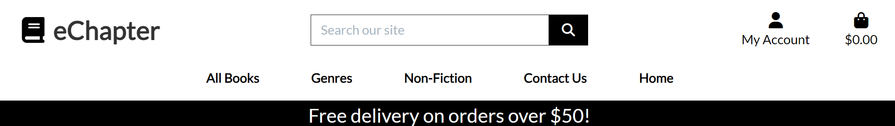

Top Navigation Bar: On desktop, the top navigation bar provides quick access to essential user features. It includes a search bar for finding books, 'My Account' options for registered users, and the shopping bag with the total purchase amount.

Main Navigation: Below the top navigation bar, a second navigation bar provides links to different categories of books (e.g., Fiction, Non-Fiction, Best Sellers, etc.) and other essential pages like 'Contact'.

- Mobile Navigation

Hamburger Menu: On mobile devices, the top and main navigation bars are replaced by a hamburger menu located at the top-left corner of the screen. Tapping on this opens a side navigation drawer.

Search: The search functionality is accessible via an icon, which expands into a search bar upon tapping.

User and Bag Icons: The 'My Account' and 'Shopping Bag' features are represented by their respective icons at the top-right corner, next to the search icon.

### Footer

The footer of eChapter serves as a multi-functional area that provides additional information and functionalities for both casual browsers and registered users.

- Social Links: On the left side of the footer, you'll find social media links that encourage users to stay connected with eChapter on platforms like Facebook. A brief message entices users to keep up to date with the latest offerings.
- Newsletter Signup: On the right side, there's a "Subscribe" section where users can sign up for the eChapter newsletter. This feature uses Mailchimp integration and comes with an email input and a 'Subscribe' button.
- Privacy Policy: A link to the privacy policy is also included, ensuring transparency about how user data is handled.
- Design: The footer is designed with a dark background to separate it from the main content visually, making it distinct and easy to locate.
- Responsiveness: The layout of the footer is fully responsive, ensuring a consistent look and feel on both desktop and mobile devices.

This footer provides a final touch to the website, adding both functionality and informational resources for users.

### Home Page

Background Image: The homepage features an inviting background image that sets the tone for the user's experience. The image showcases a cozy reading environment, resonating with the book lovers who visit our site. It serves not just as eye-candy but also as an emotional touchpoint, inspiring users to explore the world of books that "eChapter" offers.

"Shop Now" Callout Button: Prominently displayed against the background image is a "Shop Now" callout button. This button serves as an immediate call-to-action, guiding new visitors directly to our curated selection of books. It's designed to be eye-catching and is strategically placed to capture attention and encourage user engagement.

### Products Page

- Book Listings: The Products Page serves as the heart of our online bookstore, displaying an extensive list of books available for purchase. Each book is presented with its cover image, title, and price, offering users an at-a-glance view of our inventory.

- Sort By Dropdown: To enhance user experience, a 'Sort By' dropdown menu is provided at the top of the page. This feature allows users to sort the book listings based on different criteria such as 'Best Priced', or by 'Category'. It's a helpful tool for users to find books that best suit their interests or budget.

- Total Number of Books: Located at the top left corner of the page, the total number of books available is displayed. This feature gives users an idea of the breadth of our collection, and serves as a quick reference for the scale of options available to them.

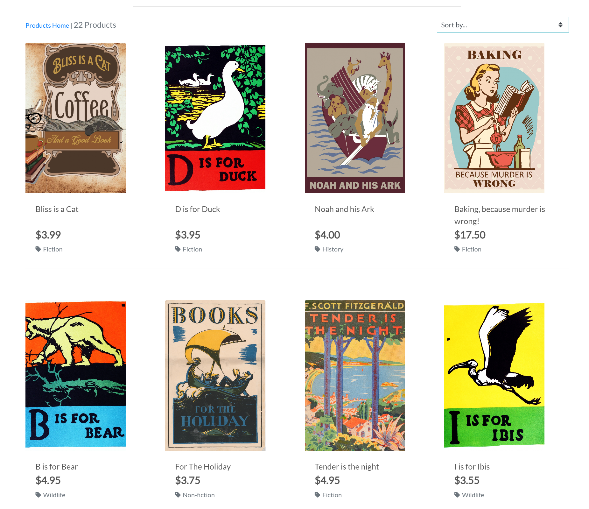

### Book Details Page

- Cover Image & Book Title: At the top of the Book Detail Page, users are greeted with a large cover image alongside the book's title. This visual representation gives users a closer look at what they're interested in purchasing, enhancing their shopping experience.

- Quantity Selection: For user convenience, the page provides buttons to increase or decrease the quantity of the selected book. This allows users to easily adjust the number of copies they wish to purchase, directly from the Book Detail Page.

- Add to Bag: A prominent 'Add to Bag' button is featured below the quantity selection, allowing users to quickly add the selected book to their shopping bag. This button is designed for quick and easy navigation, saving users the hassle of going back and forth between pages.

- Keep Shopping: If users want to continue browsing, a 'Keep Shopping' button is also available next to the 'Add to Bag' button. This takes users back to the Products Page, facilitating a seamless shopping experience.

### Shopping Bag Page

- Itemized List: As users navigate to the Shopping Bag Page, they're presented with an itemized list of all books they've added to their bag. This provides a quick overview and allows for easy review before proceeding to checkout.

- Cover Images: Next to each book title is its cover image, giving users a visual reminder of what's in their bag and enhancing the overall shopping experience.

- Bag Total & Grand Total: The page prominently displays both the 'Bag Total' and the 'Grand Total,' helping users understand the cost breakdown and keep track of their spending.

- Free Delivery Indicator: A helpful note indicates how much more needs to be spent to qualify for free delivery, encouraging users to meet that threshold and save on shipping.

- Keep Shopping: A 'Keep Shopping' button is conveniently placed for those who wish to continue browsing and add more books to their bag. Clicking this takes users back to the Products Page.

- Secure Checkout: For users ready to finalize their purchase, a 'Secure Checkout' button is featured at the bottom of the page. This leads to a secure checkout process where payment information can be safely entered.

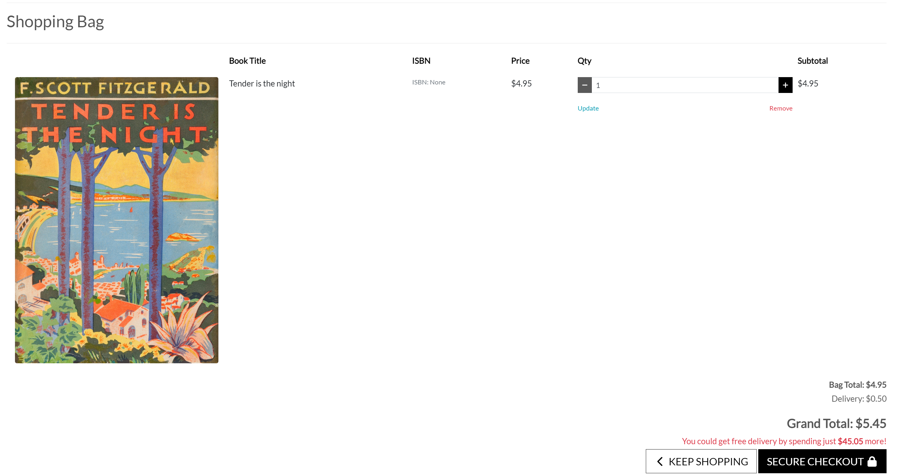

### Checkout Page

- Order Summary: At the top, the page provides a succinct order summary, showing all the items you are about to purchase.
- Cover Images: Each book in your order is represented with its cover image, so you can visually confirm the items in your bag.
- Bag and Grand Total: The total cost of the items in your bag and the grand total (including any additional charges) are clearly displayed.
- Free Delivery Indicator: If you haven't reached the amount for free delivery, the page will show you how much more you need to spend.
- Payment Information: A secure form is provided for you to enter your payment details. You can be confident in the security measures we've implemented to protect your information.
- Keep Shopping and Secure Checkout Buttons: Two action buttons are provided at the bottom of the page:
Keep Shopping: Takes you back to the Products Page if you wish to add more items.
Secure Checkout: Finalizes your order and processes the payment.

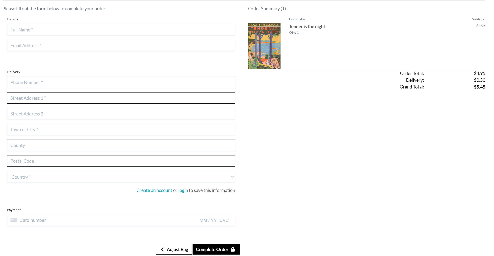

### Profile Page

- Personal Information: At the top, you'll find a section displaying your personal information such as name and email address, allowing you to quickly confirm or change details.
- Order History: Below the personal information, the page features an "Order History" section. This section lists all your past purchases, providing details like order number, date, and total amount.
- Order Confirmation: Clicking on an order will expand it to reveal more details, including the list of books purchased, their quantities, and individual prices.
- Navigation: The Profile Page is easily accessible from the main navigation bar, ensuring that you can quickly jump to other sections of the site.

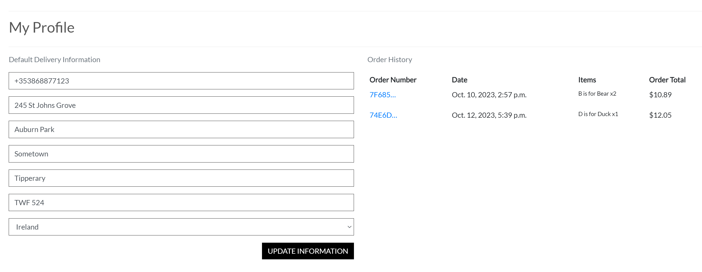

### Product Management Page

The Product Management Page is the control center for adding new books to the eChapter store. This page is accessible only to authenticated users with the appropriate permissions.

- Add Book Form: The core feature of this page is the "Add Book" form, which offers fields for all the necessary book details, including title, ISBN, publisher, price, and cover image.
- Validation: As you fill out the form, validation checks ensure that all entered information adheres to the required formats, helping maintain the integrity of the store's database.
- Preview: Before submitting, users have the opportunity to preview how the book will appear in the store, providing a final check to ensure accuracy.
- Submission: A straightforward "Submit" button allows for quick and easy addition of new books to the store's inventory.
- Navigation: A breadcrumb trail at the top and bottom of the page enables easy navigation back to the main dashboard or other parts of the admin area.
- Feedback: Upon successful submission, a confirmation message is displayed, and the new book immediately becomes available in the store.

This page is designed to make the process of adding new books as seamless and error-free as possible, empowering users to grow the eChapter catalog effortlessly.

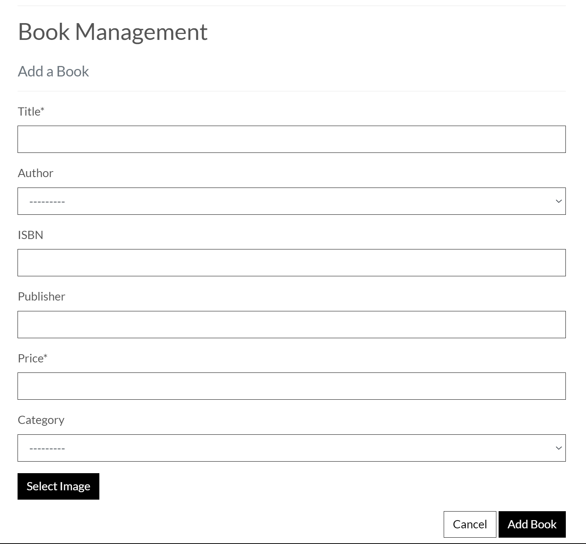

### Confirmation of Purchase Email

After successfully making a purchase on eChapter, users receive a confirmation email. This not only verifies the email address provided but also serves as a receipt for their purchase. The email is well-formatted and contains all the essential details, enhancing the overall user experience.

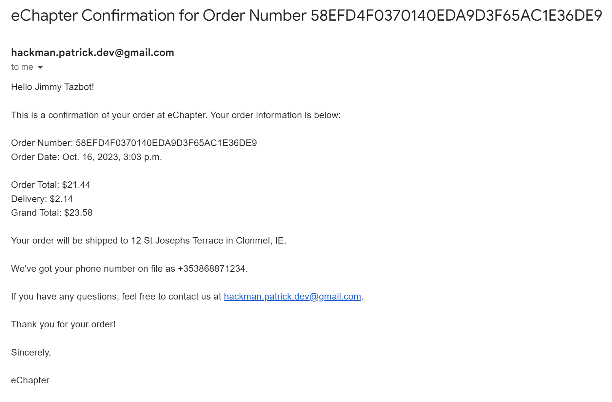

### Toast Notifications

eChapter utilizes Bootstrap's Toast notifications for a better user experience. These Toasts appear at the top of the screen to confirm actions taken by the user, such as successfully adding a book to the shopping bag or completing a purchase. The Toasts are designed to be attention-grabbing yet non-intrusive, allowing users to continue browsing without any hurdles.

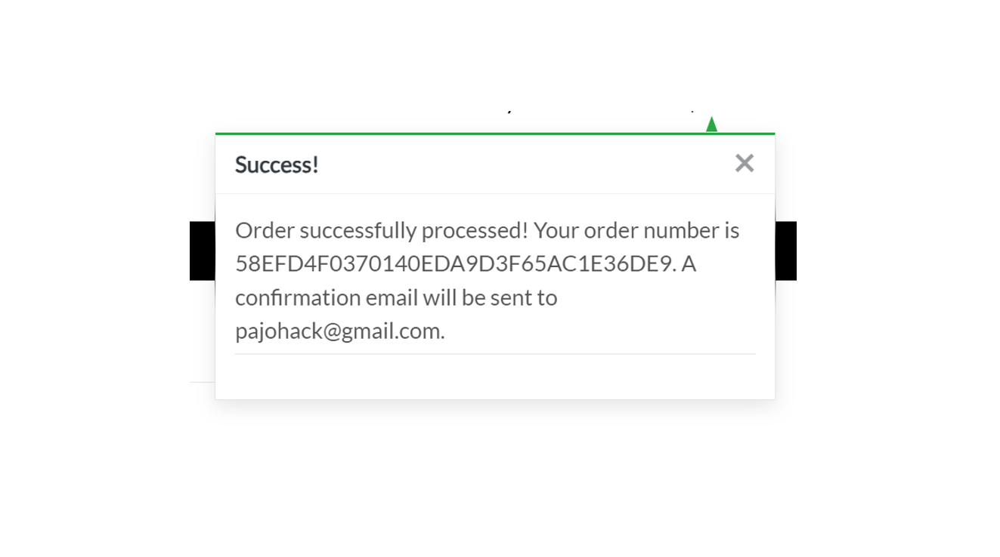

### Custom Error Pages

- 500 Error Page

During development, we've taken steps to handle errors as gracefully as possible. However, in the rare case that a 500 Internal Server Error occurs, a dedicated error page will be displayed to the user. We are continuously working to minimize these occurrences and improve the stability of the platform.

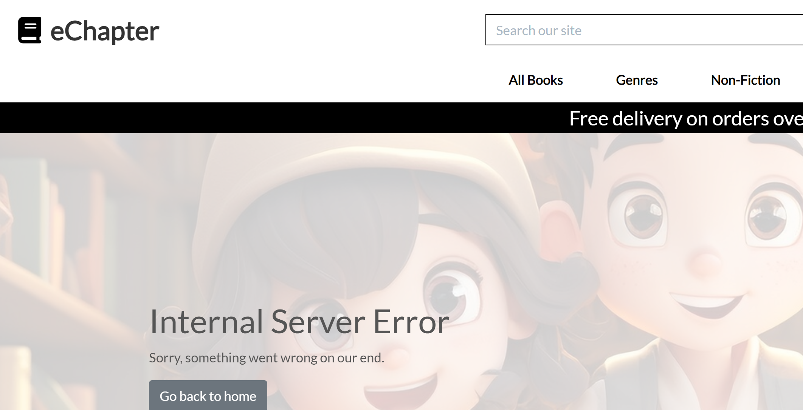

- 404 Error Page 

In the event that a user tries to access a page that doesn't exist on our platform, we've designed a custom 404 Not Found page to guide them back to the main site. This enhances the user experience by providing a cohesive look and feel even in error scenarios.

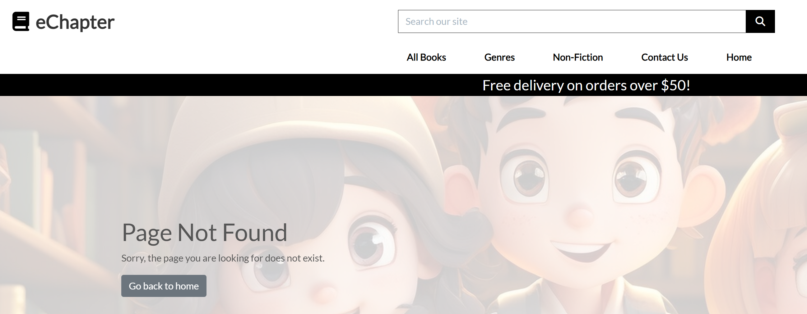

- 403 Error Page

The custom 403 (Forbidden) page is designed to inform users when they've tried to access a resource for which they do not have permission, offering a seamless experience by maintaining the site's overall look and feel. A 'Go back to home' button is provided for easy navigation back to the homepage.

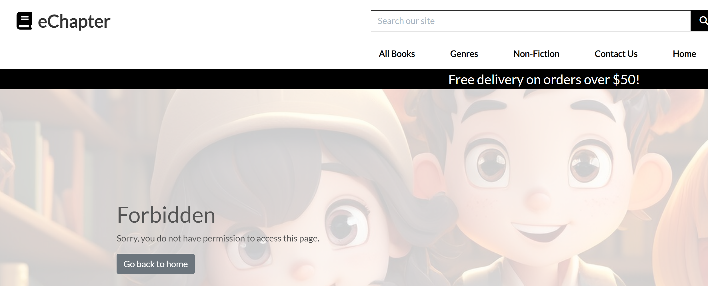

### Contact Us Form

The 'Contact Us' section serves as a crucial touchpoint between the website and its users. Designed for ease of use and accessibility, this feature allows customers to quickly get in touch with the support team for any queries or issues they may have. The form fields include the essentials, name, email, and the message itself, to streamline the communication process. Once the form is submitted, users receive an immediate confirmation to assure them that their query has been received and will be addressed promptly. This section aims to bolster customer trust and ensure a smooth user experience by providing a direct line of communication to the site administrators

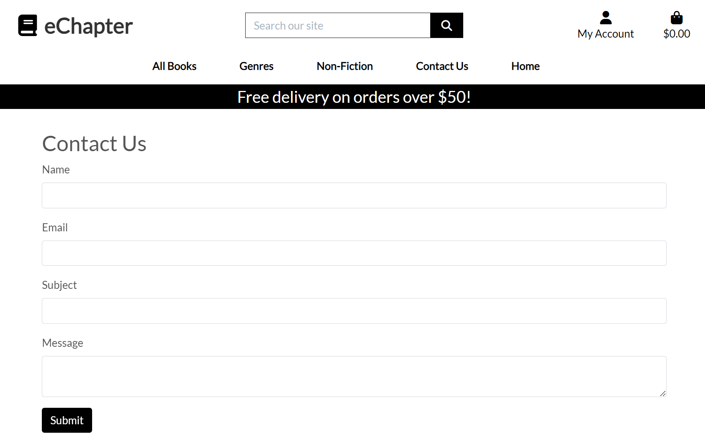

[Back to the top](#)

# Future Features

- User Reviews and Ratings: Allow registered users to leave reviews and ratings for books they have purchased, which could then be displayed on each book's detail page.
- Gift Cards and Coupons: Implement a system where users can purchase and redeem gift cards or coupons, providing more flexible payment options.
- Digital Downloads: Offer books in digital formats such as ePub or PDF, in addition to physical copies.
- Social Media Integration: Allow users to share their purchases or favorite books on social media platforms directly from the site.

[Back to the top](#)

# Seo & Marketing

[SEO and Marketing README link](SEO_MARKETING_README.md)

# Testing

[Testing README link](TESTING_README.md)

# Project Management and Documentation

## GitHub Project Boards

I used GitHub Project Boards to manage the tasks and sprints for the development of eChapter. Each sprint was represented as a separate column, and tasks were added as cards within these columns. We moved the cards through statuses like 'To Do', 'In Progress', and 'Done' to reflect their current state.

Example: [GitHub Project Board](https://github.com/users/PajoHack/projects/9)

GitHub Issues
Issues were used to break down tasks into manageable units of work. Each issue was tagged with appropriate labels for easy categorization and was linked to the corresponding milestone and project board.

Example: [USER STORY: Add a book #21](https://github.com/PajoHack/eChapter-bookstore-PP5/issues/21)

GitHub Milestones
Milestones were used to mark significant phases in the project. Each milestone included a group of related issues that were to be completed for that phase to be considered complete.

Example: [Integrate Stripe](https://github.com/PajoHack/eChapter-bookstore-PP5/milestone/7)

[Back to the top](#)

# Deployment

### Deploying to Heroku

- Initial Setup: Create a requirements.txt file in the root directory to specify the Python dependencies that need to be installed for the project to run.
- Procfile: Create a Procfile in the root directory to tell Heroku how to run the application.
- Heroku Account: Create an account on Heroku and install the Heroku CLI.
- Create Heroku App: Run heroku create <app_name> to create a new Heroku app.
- Git Remote: Heroku automatically adds its remote settings for deployment. Confirm this by running git remote -v.
- Environment Variables: Set up environment variables in Heroku under the "Settings" tab in the "Config Vars" section.
- Deploy: Push the project to Heroku by running git push heroku master.
- Post-deployment Steps: Run any necessary commands for your project, such as migrating the database.

### AWS

Using AWS for Static and Media Files
AWS S3 (Simple Storage Service) was used to serve static and media files for this project.

- AWS Account: Create an AWS account if you haven't already.
- S3 Bucket: Create a new S3 bucket.
- Bucket Policy: Set up a bucket policy to make the bucket's contents publicly accessible.
- CORS Configuration: Add a CORS configuration to enable cross-origin resource sharing.
- Django Settings: Update settings.py with AWS configurations, using django-storages and boto3 to connect to S3.
- Collect Static: Run python manage.py collectstatic to push static files to the S3 bucket.
- Media Files: Upload any initial media files to the S3 bucket.

### Cloning and Forking the GitHub Repository

To Clone:

- Navigate to the main page of the GitHub repository.
- Click the "Code" button and copy the URL.
- Open your terminal and navigate to the directory where you want to clone the repository.
- Run git clone <URL>.

To Fork:

- Navigate to the main page of the GitHub repository.
- Click the "Fork" button at the top-right corner. This creates a copy of the project in your GitHub account.
- You can now clone this forked repository using the steps above, make changes, and create pull requests to contribute to the original project.

[Back to the top](#)

# Technologies Used

### Programming Languages

- Python: The backend of the project is written in Python, using the Django framework.
- JavaScript: Used to add interactivity to the website.
- HTML: The structure of the website.
- CSS: Styling of the website, in conjunction with Bootstrap 4.

### Frameworks & Libraries

- Django: Python web framework used for building the application.
- Bootstrap 4: Front-end framework used for designing responsive and mobile-first web pages.
- jQuery: JavaScript library used for DOM manipulation and handling user events.

### APIs

- Stripe API: For handling payments.

### Databases

- SQLite: Used in development for storing relational data.
- ElephantSQL: Used in production, hosted on Heroku.

### Version Control

- Git: For version control.
- GitHub: As a Git repository hosting service.

### Hosting/Servers

- Heroku: Cloud platform for hosting the web application.

### Storage

- AWS S3: Used for storing static and media files in production.

### Planning and Documentation Tools

- Balsamiq: Used for creating wireframes during the planning phase.
- Lucidchart: Utilized for designing the database schema and understanding the relationships between different tables.
- Privacy Policy Generator: Used to generate a privacy policy for the website.

### Other Tools

- Font Awesome: For icons used across the website.
- Mailchimp: For email subscriptions and marketing.

[Back to the top](#)

## MoSCoW Prioritization

For this project, we used the MoSCoW method for prioritizing features. Below is a breakdown of how features were categorized:

### Must-have

- Secure user authentication
- Basic CRUD for books
- Payment integration (Stripe)

### Should-have

- User profiles
- Advanced Search Filters

### Could-have

- Social Media Sharing

### Won't-have (this time)

- Reviews and Ratings
- Items on Sale

By using MoSCoW prioritization, we were able to focus on delivering the most critical features first, while also planning for future improvements.

[Back to the top](#)

# Credits

### Boilerplate Code

Boutique Ado Project: The base code for this project was inspired by the Boutique Ado project. This includes the Stripe payment integration and the Toasts functionality for notifications.

[Back to the top](#)

# Acknowledgements

I would like to express gratitude to my mentor, Brian Macharia, for his support and invaluable guidance throughout the course of this project. His expertise and insights have been instrumental in helping me navigate through the challenges I encountered, and his constructive feedback has been greatly appreciated. 

[Back to the top](#)
