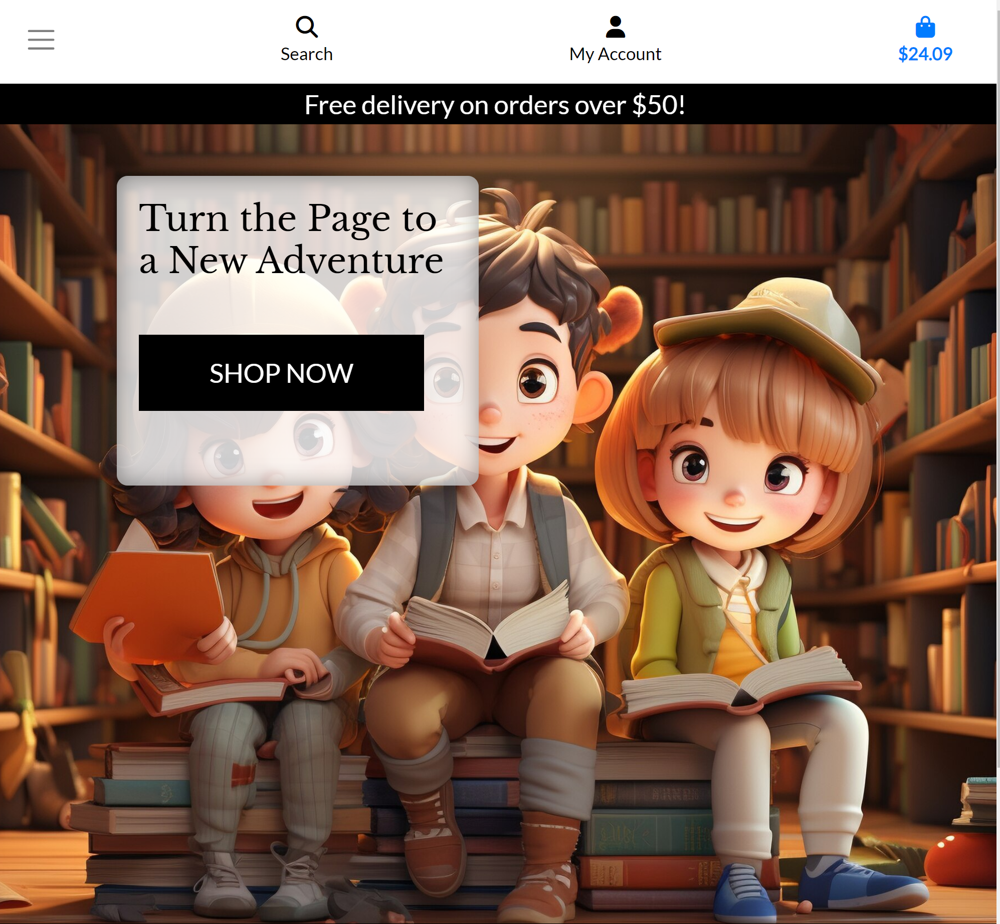

# eChapter - Online Bookstore

The digital age has made it easier than ever to access a wide range of books across multiple genres. However, with the vast array of options available, it can be overwhelming for readers to find books that cater to their specific interests, let alone in a user-friendly manner. eChapter was created as a solution to this problem, offering a carefully curated collection of books for a diverse readership, all available at the click of a button.

The primary purpose of eChapter is to provide an online platform where users can explore, select, and purchase books with ease. Our aim is to simplify the book-buying process while offering a wide range of options to cater to varied reading interests. eChapter targets a wide range of audiences, including but not limited to: avid readers, casual readers, students and profesionals alike.

Addressing User Needs, eChapter aims to meet the varying needs of its target audience. 

- Ease of Use: A clean, intuitive interface ensures that users can navigate the site easily.
- Search and Filters: Robust search functionality, along with various filter options, help users find books that fit their interests or needs.
- Secure Transactions: Integration with Stripe ensures a secure and smooth checkout process.
- Accessibility: The responsive design ensures that users can access the site from any device
- Personalized Experience: User profiles and book recommendations cater to individual reading preferences, enhancing the shopping experience.

### Business Goals

- Market Penetration: To become a notable player in the online bookstore industry within the first year of operation.
- Customer Retention: Achieve a customer retention rate of at least 70% within the first two years.
- Revenue Growth: Aim for a 20% increase in revenue quarter-over-quarter for the first two years.
- Expand Inventory: Increase the catalog by 50% in the first year, focusing on niche markets and special interests.
- Brand Recognition: Establish eChapter as a trusted brand synonymous with diverse reads and customer service excellence.

### Customer Goals

- Accessibility: Find and purchase books with ease from any device.
- Affordability: Competitive pricing and special offers to make reading more affordable.
- Diversity: Access to a broad range of titles across various genres and themes.
- Personalization: Tailored recommendations and a user-friendly interface for a unique shopping experience.
- Support: Efficient customer support to assist with inquiries and issues.

## Design and UX

### Background Colors

The background colors for eChapter have been carefully selected to provide a neutral yet inviting canvas that allows the products and text to be the focal points. The primary background color is a light shade, which not only provides excellent contrast for text but also creates an open and airy feel, mimicking the experience of walking into a well-lit, organized bookstore.

### Text Colors

Text colors are primarily dark shades like black or dark gray. The aim is to maximize readability and reduce eye strain, especially during prolonged use. We've also employed color hierarchy; headlines or important text elements might be in bold and a darker shade, while secondary text could be a lighter shade of gray.

The color scheme is a crucial part of the overall design and user experience of eChapter. It serves functional purposes, like readability and accessibility, while also contributing to the brand's emotional resonance with users. Careful selection and testing have gone into these choices to create an interface that is not just visually pleasing but also user-friendly.

### Wireframes

- Home Page

- Products Page

- Product Detail Page

- Shopping Bag Page

- Checkout Page

- Profile Page

### Databse Model

- Category and Author models in the products app are connected to the Book model via ForeignKey fields.
- The Book model is connected to OrderLineItem in the checkout app, which in turn is connected to Order.
- Order is connected to UserProfile in the profiles app.
- UserProfile has a OneToOneField relationship with Django's built-in User model.
- The Contact model in the contactus app is not directly related to any other models.

## Epic and User Stories

### Epic

The overarching epic of the eChapter project is to revolutionize the way people discover, purchase, and engage with books in a digital landscape. In an era where physical bookstores are dwindling and the power of choice is at our fingertips, eChapter aspires to be the trusted online portal for literature enthusiasts, students, and professionals alike. Through features like a diverse catalog, personalized recommendations, and seamless payment options, the project aims to offer more than just a transactional experience; it seeks to build a community of avid readers. By merging the cozy ambiance of a traditional bookstore with the convenience and efficiency of online shopping, eChapter sets out to preserve the essence of reading while adapting to the demands of the modern world. Every design decision, feature implementation, and user interaction is guided by this epic, ensuring that the platform is not just a marketplace but a sanctuary for those who find solace in the written word.

### User Stories

### Viewing and Navigation

| User Story Number | As A/An | I can                     | So that                                                 |
|-------------------|---------|---------------------------|---------------------------------------------------------|
| 1                 | Shopper | View a list of books       | I can select books to purchase                          |
| 2                 | Shopper | View individual book details| I can see the price, description, rating and cover image|
| 3                 | Shopper | Identify items on sale     | I can take advantage of bargain offerings               |
| 4                 | Shopper | Easily view total of purchases at all times | I avoid spending too much        |

### Registration and User Accounts

| User Story Number | As A/An    | I can                        | So that                                         |
|-------------------|------------|------------------------------|--------------------------------------------------|
| 5                 | Site User  | Register for an account      | I have a personal account available to me       |
| 6                 | Site User  | Quickly login & logout       | I can access my personal information or logout  |
| 7                 | Site User  | Reset my password if forgotten| I can recover access to my account             |
| 8                 | Site User  | Have a User Profile          | I can view order history & order confirmations  |
| 9                 | Site User  | Receive an email confirmation after registering| I can verify my account was setup correctly |

### Sorting and Searching

| User Story Number | As A/An | I can                     | So that                                             |
|-------------------|---------|---------------------------|------------------------------------------------------|
| 10                | Shopper | Sort the list of books     | I can see the best rated, best priced, and see books sorted by category |
| 11                | Shopper | Sort by specific category  | I can see all books in that particular category     |
| 12                | Shopper | Search for a book by title or description| I can search for specific books   |
| 13                | Shopper | Easily view search results | I can determine if a book is available              |

### Products & Checkout

| User Story Number | As A/An | I can                     | So that                                             |
|-------------------|---------|---------------------------|------------------------------------------------------|
| 14                | Shopper | Select the product I want to purchase | I can select the correct book               |
| 15                | Shopper | View items in my bag       | I can see the total cost and items in it            |
| 16                | Shopper | Adjust the amount of individual items in the bag| I can make changes before checkout if required |
| 17                | Shopper | Enter my payment information| Checkout quickly with minimal fuss                 |
| 18                | Shopper | Feel safe about entering my payment details | I can confidently provide payment details |
| 19                | Shopper | View an order confirmation after checkout | I can ensure that I ordered the correct items |
| 20                | Shopper | Receive an email confirmation after checkout | I have a record of my purchase |

### Admin or Store Owner

| User Story Number | As A/An      | I can                | So that                                             |
|-------------------|--------------|----------------------|------------------------------------------------------|
| 21                | Store Owner  | Add a book            | I can add new stock to my store                     |
| 22                | Store Owner  | Edit or update a product| I can alter prices, description and image          |
| 23                | Store Owner  | Delete a book         | I can remove books that are sold out or no longer available |

# Features