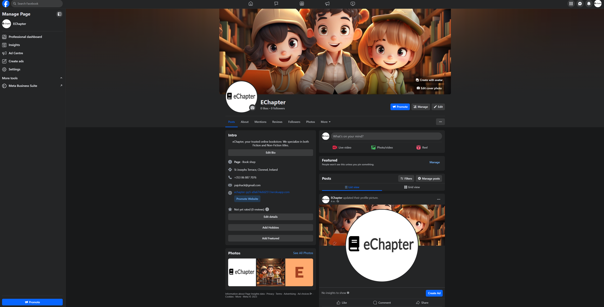
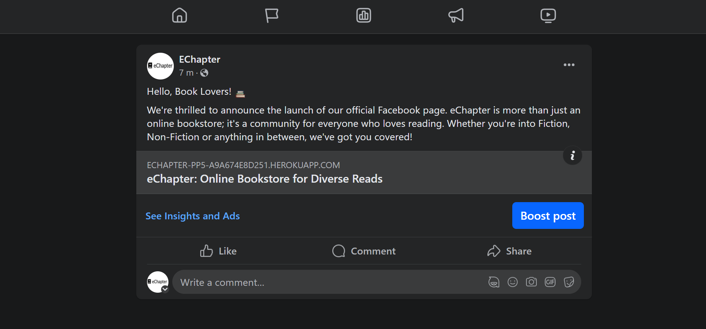

# SEO and Marketing Documentation for eChapter

[Back to Main README](README.md)

## Table Of Contents

1. [Introduction](#introduction)
2. [Business Model](#business-model)
3. [Keywords](#keywords)
4. [User Needs](#user-needs)
5. [Marketing Strategies](#marketing-strategies)
6. [Content Is King](#content-is-king)

## Introduction

This document outlines the search engine optimization (SEO) and marketing strategies applied to the eChapter online bookstore. The purpose of this guide is to provide a roadmap for increasing visibility, attracting a broader audience, and ultimately increasing sales.

## Business Model

eChapter operates on a Business-to-Customer (B2C) model, focusing on direct transactions with end users. This model emphasizes customer-centric approaches in both SEO and marketing to enhance user experience and increase sales.

## Keywords

### Short-tailed Keywords

- Books
- Reading
- Novels
- Fiction
- Non-fiction

### Long-tailed Keywords

- Buy affordable books online
- Best online bookstore for fiction
- Where to buy non-fiction books online
- Latest best-selling novels online
- High-quality books for sale online

## User Needs

- Ease of Navigation: Users should be able to easily browse and search for books.
- Information: Detailed book descriptions, ratings, and reviews should be available.
- Security: A secure checkout process to ensure user trust.
- Affordability: Competitive pricing and special offers to attract budget-conscious shoppers.

## Marketing Strategies

### Social Media Marketing

The primary focus of eChapter's market strategy is to build a community of avid readers and book enthusiasts who are continually engaged and converted into loyal customers. Our Facebook page serves as a vital tool in achieving this objective. Through targeted social media campaigns, we aim to attract a diverse audience. We'll post regular content that resonates with our target market, such as book reviews, author interviews, and limited-time offers.

Leveraging Facebook's analytics tools, we'll continually monitor key performance indicators like engagement rate, click-through rate, and conversion rate. This data will help us refine our marketing strategies and make data-driven decisions to maximize ROI. In the long term, we plan to expand our social media presence to other platforms such as Instagram and Twitter to reach a broader audience. However, Facebook will remain the cornerstone of our online community-building efforts.

- Platforms: Facebook Page

- Facebook Post

## Content is King

In the digital age, content serves as the cornerstone of all SEO and marketing efforts. High-quality, relevant content not only enhances user experience but also boosts the website’s visibility on search engines. I prioritize generating unique and compelling content for book descriptions, Facecook posts, and marketing materials to engage our audience and establish eChapter as an authority in the online book retail space.

[Back to the top](#)

[Back to Main README](README.md)
