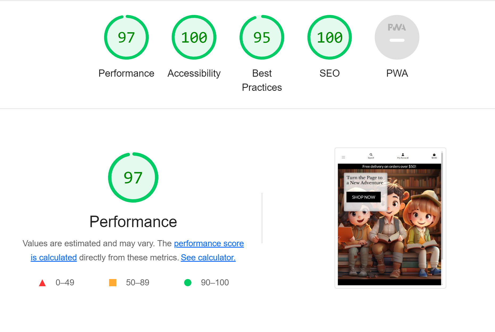

# Testing

This document outlines the various testing methods applied to ensure the functionality, accessibility, and compatibility of the eChapter application.

### Code Validation

- HTML: Validated using W3C HTML Validator.
- CSS: Validated using W3C CSS Validator.
- JavaScript: Checked for errors using JSHint.
- Python: Checked for PEP 8 compliance using pylint.

### Browser Compatibility

The site was tested on multiple browsers including:

- Google Chrome
- Mozilla Firefox
- Microsoft Edge
- Safari

### Lighthouse Testing

### Performance Testing

Used Google Lighthouse to analyze the performance of the website on various fronts such as Performance, Accessibility, Best Practices, and SEO.

### Manual Testing

Manual testing was conducted to ensure a thorough evaluation of the site's functionality and usability. Below are the areas and features that were manually tested:

### Navigation

1. **Header Links**
    - Tested that all header links navigate to the correct page.
    - Checked that the logo redirects to the home page.

2. **Footer Links**
    - Verified that social media links open in a new tab and go to the correct URL.
    - Checked that the "Privacy Policy" link navigates to the correct section.

### Forms

1. **Registration and Login**
    - Attempted to register with invalid and valid credentials.
    - Checked the login functionality with both incorrect and correct credentials.
    - Tested the "Forgot Password" feature.

2. **Search Bar**
    - Conducted searches using various terms to see if the relevant results are displayed.

### User Flows

1. **Adding Items to Bag**
    - Added multiple items to the bag and checked if the bag is updated correctly.

2. **Checkout Process**
    - Went through the checkout process with different payment methods to ensure the transactions are processed correctly.

3. **Profile Page**
    - Checked that the order history is displayed correctly in the profile page.

### Responsiveness

1. **Mobile, Tablet, and Desktop**
    - Checked the website's responsiveness on various devices using both real devices and browser tools for emulation.

2. **Cross-Browser Compatibility**
    - Tested the site on different browsers like Chrome, Firefox, and Safari to ensure cross-browser compatibility.

### Error Handling

1. **404 and 403 Pages**
    - Tested the custom 404 and 403 error pages by manually entering incorrect URLs and trying to access restricted areas.

2. **Form Errors**
    - Checked that proper error messages are displayed when submitting forms with invalid data.

### Additional Notes:
- All tests were conducted multiple times and at different stages of development to confirm consistency.
- Where issues were found, they were addressed immediately and re-tested to confirm they were resolved.

### User Stories Testing

For each user story, a systematic testing approach was followed to ensure that the website meets the needs of its different types of users.

## User Stories Testing

For each user story, a systematic testing approach was followed to ensure that the website meets the needs of its different types of users.

## User Stories Testing

For each user story, a systematic testing approach was followed to ensure that the website meets the needs of its different types of users.

| User Story Number | User Type      | User Story                                                         | Testing Method                                                                     | Result | Additional Notes |
|-------------------|----------------|--------------------------------------------------------------------|-------------------------------------------------------------------------------------|--------|------------------|
| 1                 | Shopper        | View a list of books to select books to purchase                    | Manually browsed the site as a shopper and verified that the list of books is displayed. | Passed | All books appeared as expected with relevant details. |
| 2                 | Shopper        | View individual book details to see the price, description, rating, and cover image | Clicked on individual books to view details.                                      | Passed | Details, including price and rating, were clearly visible. |
| 3                 | Shopper        | Identify items on sale to take advantage of bargain offerings       | Checked that books on sale are clearly marked.                                      | Passed | Sale items were appropriately labeled. |
| 4                 | Shopper        | Easily view total of purchases at all times                         | Checked that the total cost of items in the bag is visible at all times.            | Passed | Bag total was consistently visible. |
| 5                 | Site User      | Register for an account                                             | Attempted to register a new account.                                                | Passed | Received an email confirmation upon registration. |
| 6                 | Site User      | Quickly login & logout                                              | Successfully logged in and out of an account.                                       | Passed | Login and logout were seamless. |
| 7                 | Site User      | Reset my password if forgotten                                      | Used the "Forgot Password" feature to reset the password.                           | Passed | Received an email with reset instructions. |
| 8                 | Site User      | Have a User Profile                                                 | Checked that the profile page is available after logging in.                        | Passed | Profile page displayed order history. |
| 9                 | Site User      | Receive an email confirmation after registering                     | Checked email after registration.                                                   | Passed | Email received with verification link. |
| 10                | Shopper        | Sort the list of books                                              | Used the sorting dropdown to sort books by various criteria.                        | Passed | Sorting function worked as expected. |
| 11                | Shopper        | Sort by specific category                                           | Sorted books by selecting a specific category.                                      | Passed | Books were correctly sorted by the selected category. |
| 12                | Shopper        | Search for a book by title or description                           | Used the search function to find books by title or description.                     | Passed | Search results matched query parameters. |
| 13                | Shopper        | Easily view search results                                          | Checked that search results are easily readable and relevant.                       | Passed | Results were clear and relevant to the search term. |
| 14                | Shopper        | Select the product I want to purchase                               | Selected a product and added it to the bag.                                         | Passed | Product was successfully added to the bag. |
| 15                | Shopper        | View items in my bag                                                | Opened the bag to view items.                                                       | Passed | All items and their quantities were correctly displayed. |
| 16                | Shopper        | Adjust the amount of individual items in the bag                    | Adjusted the quantity of items in the bag.                                          | Passed | Quantities were successfully updated. |
| 17                | Shopper        | Enter my payment information                                        | Entered payment details during checkout.                                            | Passed | Payment went through successfully via Stripe. |
| 18                | Shopper        | Feel safe about entering my payment details                         | Checked that the payment form is secure (SSL, Stripe integration).                   | Passed | Site is SSL secured and Stripe is used for payments. |
| 19                | Shopper        | View an order confirmation after checkout                           | Checked that an order confirmation page is displayed after checkout.                | Passed | Order confirmation displayed with all relevant details. |
| 20                | Shopper        | Receive an email confirmation after checkout                        | Checked email after completing a purchase.                                          | Passed | Email received with order summary. |
| 21                | Store Owner    | Add a book                                                          | Added a new book via the product management page.                                    | Passed | New book appeared in the store after addition. |
| 22                | Store Owner    | Edit or update a product                                            | Edited an existing book's details.                                                  | Passed | Changes were reflected immediately. |
| 23                | Store Owner    | Delete a book                                                       | Deleted a book via the product management page.                                      | Passed | Book was successfully removed from the store. |

